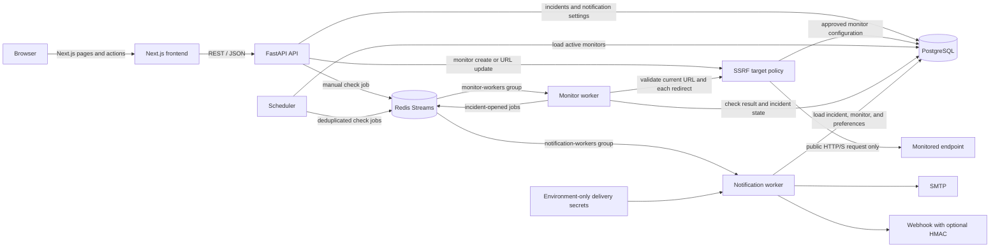
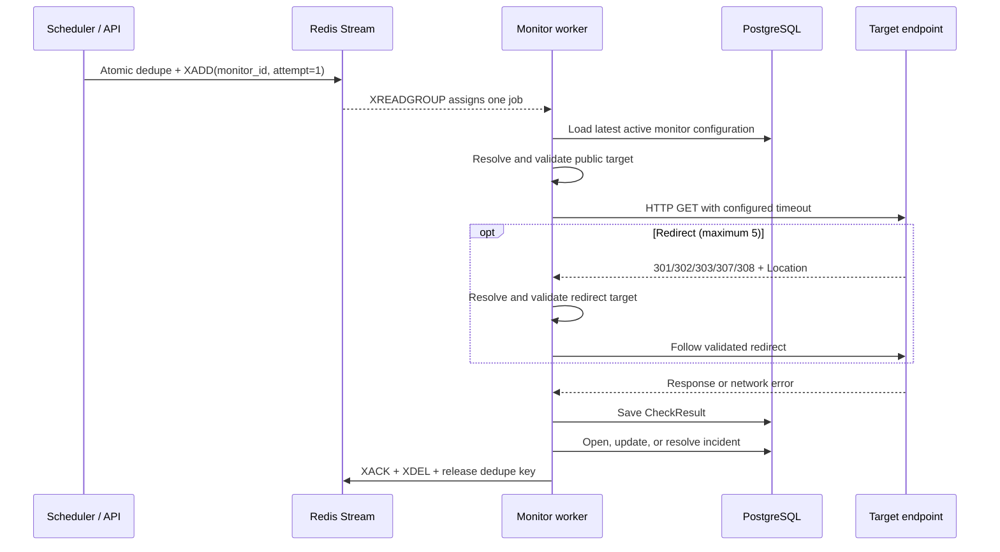
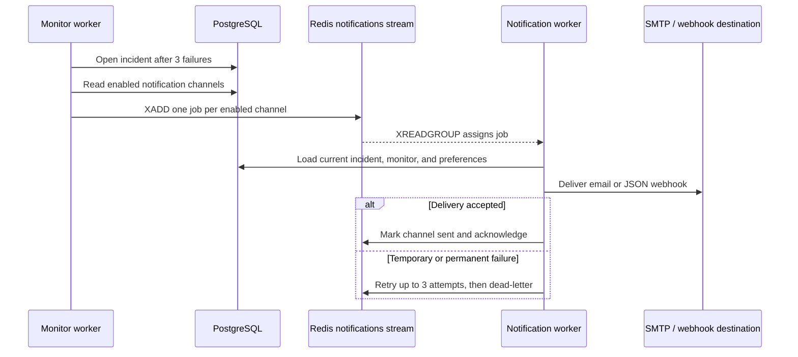

# API Checker

[](https://github.com/Dede9274/Personal_Projects/actions/workflows/api-functionality-ci.yml)

Self-hosted uptime monitoring with a live dashboard, durable check history, incident tracking, and email or webhook alerts.

API Checker separates its REST API, scheduler, check execution, and notification delivery into independent processes. PostgreSQL owns application data; Redis Streams coordinate background work. The result is a small system that can run on a laptop with one Docker command while retaining the failure-handling patterns used by larger distributed services.

## At a glance

- Create, edit, pause, delete, and manually check HTTP monitors.
- Block SSRF targets at creation and execution time, including every redirect.
- Configure the interval, timeout, and expected HTTP status per endpoint.
- Track latency, success rate, uptime history, and recent check results.
- Open an incident after three consecutive failures and resolve it on recovery.
- Move incidents through `OPEN`, `INVESTIGATING`, and `RESOLVED` states.
- Persist notification preferences and deliver alerts over SMTP or optionally signed webhooks.
- Verify SMTP from the dashboard with a real test email before relying on alerts.
- Distribute checks across multiple Redis consumer-group workers.
- Recover abandoned work, retry transient failures, and dead-letter exhausted jobs.
- Start the complete eight-service stack with Docker Compose.

## Screenshots

### Operations dashboard


### Monitor management


### Monitor detail and incident history


### Incident management


### Notification channels


### Monitoring settings


The screenshots use representative local data; the interface itself is the application in this repository.

## Architecture



There are two distinct paths through the system:

1. **Control plane:** the browser uses Next.js and FastAPI to manage monitors and incidents, request manual checks, and read persisted history.
2. **Monitoring data plane:** the scheduler publishes work to Redis, workers perform checks, PostgreSQL records the outcome, and notification jobs are delivered independently.

PostgreSQL is always the source of truth. Redis holds temporary delivery state and deduplication markers, not monitor configuration or check history.

## Technology choices

| Layer | Technology | Why it is used |
| --- | --- | --- |
| Web UI | Next.js 16, React 19, TypeScript | Server-rendered data views, typed API integration, and focused client interactivity |
| Styling | Tailwind CSS 4 | Fast, consistent responsive UI without a runtime styling layer |
| Charts | Recharts | Composable latency and status visualizations for React |
| API | FastAPI, Pydantic 2 | Async endpoints, strict validation, generated OpenAPI documentation |
| Data access | SQLAlchemy 2 async, Psycopg 3 | Explicit async persistence with PostgreSQL-native behavior |
| Migrations | Alembic | Versioned, repeatable schema changes |
| HTTP checks | HTTPX | Async requests, manually validated redirects, timeouts, and clear network exceptions |
| Job delivery | Redis 8 Streams | Consumer groups, pending-entry recovery, and lightweight horizontal scaling |
| Database | PostgreSQL 18 | Durable relational state, constraints, indexes, and transactional writes |
| Runtime | Python 3.11, Node.js 24 | Reproducible slim container images for the backend and frontend |
| Orchestration | Docker Compose | One-command local startup with health-checked dependencies and persistent volumes |

## One-command Docker startup

### Prerequisites

- Docker Engine with the Compose plugin, or Docker Desktop
- Ports `3000`, `8000`, `5433`, and `6379` available

From the `api_functionality` directory:

```bash
docker compose up --build
```

Compose supplies development-safe defaults, builds both application images, waits for PostgreSQL and Redis, applies Alembic migrations, and then starts the API, frontend, scheduler, and workers.

Open:

- Dashboard: <http://localhost:3000>
- Interactive API docs: <http://localhost:8000/docs>
- OpenAPI schema: <http://localhost:8000/openapi.json>

Run in the background instead:

```bash
docker compose up -d --build
```

Useful lifecycle commands:

```bash
# Service health and state
docker compose ps

# Follow application logs
docker compose logs -f api frontend scheduler monitor-worker notification-worker

# Stop the stack and retain data
docker compose down

# Stop the stack and delete PostgreSQL and Redis volumes
docker compose down -v
```

`docker compose down -v` permanently removes local application data.

### Configuration

The stack works without an environment file. To customize credentials, ports, browser origins, or notifications:

```bash
cp .env.example .env
```

Important settings:

| Variable | Default | Purpose |
| --- | --- | --- |
| `POSTGRES_USER` | `uptime_user` | PostgreSQL user |
| `POSTGRES_PASSWORD` | `uptime_password` | PostgreSQL password; change outside local development |
| `POSTGRES_DB` | `uptime_monitor` | PostgreSQL database |
| `POSTGRES_PORT` | `5433` | Host port mapped to PostgreSQL |
| `REDIS_PORT` | `6379` | Host port mapped to Redis on `127.0.0.1` |
| `FRONTEND_ORIGINS` | localhost origins | Origins permitted by FastAPI CORS |
| `SMTP_HOST` | unset | SMTP server used for email delivery |
| `SMTP_PORT` | `587` | SMTP server port |
| `SMTP_SECURITY` | `starttls` | `starttls`, `ssl`, or `none` |
| `SMTP_USERNAME` | unset | Optional SMTP account username |
| `SMTP_PASSWORD` | unset | SMTP password or provider app password |
| `SMTP_FROM_EMAIL` | unset | Sender shown on notification emails |
| `WEBHOOK_BEARER_TOKEN` | unset | Optional server-side webhook bearer credential |
| `WEBHOOK_SIGNING_SECRET` | unset | Optional secret for `X-Uptime-Signature` HMAC-SHA256 |

Channel toggles, recipients, webhook URL, and delivery timeouts are saved from the **Notifications** page in PostgreSQL. SMTP credentials stay only in `.env` and are never returned to the browser. After configuring SMTP, recreate the backend services, save an email recipient in the dashboard, and use **Send test email** to verify delivery. Webhooks can include a bearer token and an `X-Uptime-Signature` HMAC-SHA256 signature. See [notification configuration](backend/docs/notifications.md) for the complete setup.

## Services

| Service | Responsibility | Exposed port |
| --- | --- | --- |
| `frontend` | Production Next.js dashboard | `3000` |
| `api` | FastAPI monitor and incident API | `8000` |
| `scheduler` | Refresh active monitors and enqueue due checks | — |
| `monitor-worker` | Execute HTTP checks and update incident state | — |
| `notification-worker` | Send email and webhook jobs | — |
| `migrate` | Run `alembic upgrade head` before application startup | — |
| `postgres` | Durable monitor, result, and incident storage | `5433` |
| `redis` | Stream queues, pending jobs, and deduplication state | `6379`, localhost only |

Scale check throughput without changing the scheduler or API:

```bash
docker compose up -d --scale monitor-worker=3
```

All monitor workers join the same consumer group, so each stream entry is assigned to one worker at a time.

## Local development

Docker is the simplest way to run dependencies while keeping application processes on the host.

### 1. Start PostgreSQL and Redis

```bash
docker compose up -d postgres redis
```

### 2. Set up the backend

Python 3.11 or newer is recommended.

```bash
cd backend
python3 -m venv .venv
source .venv/bin/activate
pip install -r requirements.txt
cp .env.example .env
python -m alembic upgrade head
```

Start each long-running role in a separate terminal from `backend`, with the virtual environment active:

```bash
python -m uvicorn app.main:app --reload
```

```bash
python -m app.scheduler_main
```

```bash
python -m app.workers.monitor_worker --name local-monitor-1
```

```bash
python -m app.workers.notification_worker --name local-notification-1
```

The backend `.env.example` points host processes at PostgreSQL on `localhost:5433` and Redis on `localhost:6379`.

### 3. Start the frontend

Node.js 24 is recommended because it matches the container and lockfile.

```bash
cd frontend
npm ci
npm run dev
```

The frontend uses `http://localhost:8000` by default. Set `INTERNAL_API_URL` for server-side requests and `NEXT_PUBLIC_API_URL` for browser-side requests when the API is elsewhere.

Ubuntu 24.04 users can install Docker Engine, Docker Compose, Node.js 24, and npm with:

```bash
chmod +x scripts/install_ubuntu_prereqs.sh
./scripts/install_ubuntu_prereqs.sh
```

Log out and back in after the script completes so the Docker group membership takes effect.

## API architecture

FastAPI is deliberately thin: routers validate HTTP input and delegate persistence and domain work to services and repositories. Background execution never happens inside an API request; even a manual check only publishes a job.

### Monitor endpoints

| Method | Path | Behavior |
| --- | --- | --- |
| `POST` | `/monitors` | Create a monitor |
| `GET` | `/monitors` | List all monitors |
| `GET` | `/monitors/{id}` | Read one monitor |
| `PATCH` | `/monitors/{id}` | Update supplied monitor fields |
| `DELETE` | `/monitors/{id}` | Delete a monitor and its related history |
| `GET` | `/monitors/{id}/checks?limit=500` | Read newest persisted checks; limit range is 1–500 |
| `POST` | `/monitors/{id}/checks` | Queue an immediate check without changing its schedule |

Manual checks return `202 Accepted` with a Redis job ID. If a job for the monitor is already queued or running, the endpoint returns `200 OK` with `already_outstanding`; inactive monitors return `409 Conflict`.

Monitor URLs must use `http://` or `https://`, cannot contain embedded
credentials, and must resolve only to public Internet addresses. Creation and
URL updates perform this check before persistence. The worker repeats it
immediately before every request because DNS records can change after a monitor
is saved.

### Incident endpoints

| Method | Path | Behavior |
| --- | --- | --- |
| `GET` | `/incidents` | List current and historical incidents |
| `GET` | `/incidents/open` | List unresolved incidents |
| `GET` | `/incidents/{id}` | Read one incident |
| `PATCH` | `/incidents/{id}` | Apply a valid manual status transition |
| `GET` | `/monitors/{id}/incidents` | List incident history for a monitor |

### Notification endpoints

| Method | Path | Behavior |
| --- | --- | --- |
| `GET` | `/notification-settings` | Read persisted channel preferences and safe SMTP readiness details |
| `PATCH` | `/notification-settings` | Save recipients, channel toggles, URLs, events, and timeouts |
| `POST` | `/notification-settings/test-email` | Send a test message to the saved recipients |

Example monitor:

```bash
curl -X POST http://localhost:8000/monitors \
  -H 'Content-Type: application/json' \
  -d '{
    "name": "Production API",
    "url": "https://api.example.com/health",
    "purpose": "Customer-facing API",
    "interval_seconds": 30,
    "timeout_seconds": 5,
    "expected_status_code": 200,
    "is_active": true
  }'
```

## Outbound request security

Monitor URLs cross a server-side trust boundary: the worker can reach networks
that a browser user cannot. The shared SSRF policy therefore runs twice—before
a URL is stored and again immediately before the worker sends each request.

The policy:

1. Accepts only credential-free `http://` and `https://` URLs.
2. Rejects parser ambiguity such as backslashes, control characters, missing
   hosts, and invalid ports.
3. Resolves the hostname with a five-second DNS timeout and requires **every**
   IPv4 or IPv6 result to be globally reachable unicast.
4. Rejects private, loopback, link-local, multicast, reserved, and unspecified
   addresses, including `127.0.0.1`, RFC 1918 networks, `::1`, and the
   `169.254.169.254` metadata address.
5. Disables HTTPX automatic redirects, resolves and validates each redirect
   destination, and stops after five redirects.
6. Ignores proxy environment variables for monitor requests so a proxy cannot
   silently change the validated route.

A worker-side policy failure is persisted with `security_rejected=true` and
shown as **Blocked**. It remains auditable but does not reduce uptime, create or
increment an incident, resolve an existing incident, or send an outage alert.
Because DNS validation and the HTTP connection remain separate operations,
production deployments should still enforce network-level egress rules. See
[outbound request security](backend/docs/outbound-request-security.md) for the
implementation boundary and defense-in-depth guidance.

## Redis workflow

### Monitor checks



The producer uses a Lua script to atomically check a per-monitor key, append the stream entry, and store its message ID. A slow check therefore cannot accumulate duplicate scheduled jobs.

| Redis key | Role |
| --- | --- |
| `uptime:monitor-checks` | Monitor job stream |
| `monitor-workers` | Shared monitor consumer group |
| `uptime:monitor-check:outstanding:{monitor_id}` | One outstanding-job lock per monitor |
| `uptime:monitor-checks:dead` | Malformed or exhausted monitor jobs |
| `uptime:notifications` | Email and webhook job stream |
| `notification-workers` | Shared notification consumer group |
| `uptime:notification:incident-opened:{incident_id}:{channel}` | Per-incident, per-channel delivery state |
| `uptime:notifications:dead` | Exhausted notification jobs |

### Failure handling

- Workers request one entry at a time to avoid idle prefetched work.
- A heartbeat refreshes ownership while a long-running job is healthy.
- Another worker uses `XAUTOCLAIM` after 60 seconds of inactivity.
- Unexpected processing errors are retried up to three total attempts.
- Exhausted or malformed messages move to a capped dead-letter stream.
- An endpoint returning the wrong status is a valid completed check, not a queue failure.
- Security-rejected targets are persisted as `Blocked`, but do not count as downtime or alter incident state.
- Jobs are acknowledged only after persistence and incident processing complete.

This is **at-least-once delivery**. If PostgreSQL commits and a worker crashes before the Redis acknowledgement, another worker can repeat the check. The outstanding key prevents concurrent scheduling, but it cannot make a PostgreSQL commit and Redis acknowledgement one transaction. A database-backed job ID or transactional outbox would be the next step for end-to-end idempotency.

### Incident and notification lifecycle

1. Each failed check is persisted.
2. Three consecutive failures open one incident for that monitor.
3. Later failures increment its count and update the latest error.
4. Channels enabled on the Notifications page receive separate Redis jobs.
5. Per-channel keys prevent duplicate alerts while allowing one channel to retry independently.
6. The next successful check resolves the active incident automatically.

Security-rejected checks break a failure streak without changing an existing
incident because they describe a prohibited configuration, not target downtime.

For deeper queue semantics and operational commands, see [Redis worker architecture](backend/docs/redis-workers.md).

## Notification system

Notification delivery is a separate asynchronous workflow, so a slow or
unavailable SMTP/webhook provider cannot block monitor checks or incident
persistence.



| Stored in PostgreSQL from the dashboard | Kept only in server environment variables |
| --- | --- |
| Email/webhook enabled state | SMTP username and password/app password |
| Email recipients | Webhook bearer token |
| Webhook destination URL | Webhook HMAC signing secret |
| Per-channel delivery timeouts | — |
| Incident-opened event toggle | — |

Each incident/channel pair has an independent Redis delivery lock. An email
failure therefore does not prevent a webhook from succeeding, and a successful
channel is not resent when another channel retries. Exhausted jobs move to
`uptime:notifications:dead` for inspection.

To enable real email delivery:

1. Add the private `SMTP_*` transport values to `.env`.
2. Recreate `api`, `monitor-worker`, and `notification-worker`.
3. Open <http://localhost:3000/notifications>, add recipients, enable email,
   and save.
4. Select **Send test email**. The endpoint uses the saved recipients and never
   returns the SMTP password to the browser.

See [notification configuration](backend/docs/notifications.md) for SMTP
security modes, webhook signing, retry behavior, and troubleshooting.

## Continuous integration

GitHub Actions runs on every push and pull request that changes `api_functionality` or its workflow:

```text
changed push / pull request
├── Backend unit · Python 3.11
│   ├── SSRF policy, DNS/IP classes, redirects, and API rejection
│   ├── Notification settings, SMTP/webhook channels, retries, and dead letters
│   ├── Alembic single-head/offline migration validation
│   └── Complete unittest discovery
├── Backend integration · PostgreSQL 18 + Redis 8.2
│   └── Live migrations, persistence, incident lifecycle, and stream consumers
├── Docker Compose · complete eight-service topology validation
└── Frontend · Node 24 · ESLint → TypeScript → production build
```

The jobs run independently for fast feedback, cache dependencies from the
committed lockfiles, use read-only repository permissions, enforce job
timeouts, and cancel superseded runs on the same branch. The unit job names the
SSRF and notification contracts explicitly; the integration job starts clean
PostgreSQL and Redis service containers and applies every migration before
testing. External SMTP and webhook delivery remain mocked in CI so repository
secrets are never required and no real messages are sent.

Workflow: [`.github/workflows/api-functionality-ci.yml`](../.github/workflows/api-functionality-ci.yml)

## Testing

### Frontend

```bash
cd frontend
npm ci
npm run lint
npm run typecheck
npm run build
```

### Backend unit tests

With a backend virtual environment active:

```bash
cd backend
python -m unittest discover -s tests -v
```

Run only the SSRF contract tests:

```bash
python -m unittest \
  tests.test_url_validator \
  tests.test_checker \
  tests.test_monitor_service \
  tests.test_monitor_router \
  -v
```

Run only the notification contract tests:

```bash
python -m unittest \
  tests.test_notification_channels \
  tests.test_notification_config \
  tests.test_notification_producer \
  tests.test_notification_queue_worker \
  tests.test_notification_router \
  tests.test_notification_schemas \
  tests.test_notification_service \
  tests.test_notification_worker \
  -v
```

Database and Redis integration suites are skipped locally unless explicitly
enabled; CI runs them in a dedicated service-container job. To run the complete
suite against the Compose infrastructure:

```bash
docker compose up -d postgres redis migrate
docker compose run --rm \
  -e RUN_DATABASE_TESTS=1 \
  -e RUN_REDIS_TESTS=1 \
  api python -m unittest discover -s tests -v
```

The integration tests use transactions or isolated Redis key names, but should still be run against development infrastructure rather than production services.

Validate the Compose file without starting containers:

```bash
docker compose config --quiet
```

## Design decisions

| Decision | Rationale and trade-off |
| --- | --- |
| PostgreSQL is the source of truth | Monitor edits, check history, and incidents remain durable and queryable; Redis loss does not erase application records. |
| Separate scheduler and workers | Scheduling stays responsive while checks are slow, and workers can scale independently. This adds process and queue operational overhead. |
| Redis Streams over an in-process queue | Consumer groups, pending entries, and stale-job recovery support multiple processes without introducing a larger task framework. |
| One outstanding job per monitor | Prevents backlog growth when a target responds more slowly than its interval. The cadence skips overlap instead of queueing every missed run. |
| Load monitor configuration in the worker | Queued jobs use the newest URL, timeout, and active state. Redis messages stay small, at the cost of one database read per job. |
| Validate outbound targets at write and execution time | API validation gives immediate feedback; worker validation protects against later DNS changes. Automatic redirects are disabled, each destination is resolved and checked, and redirect chains stop after five hops. Rejected checks remain auditable without opening incidents. |
| Three failures before opening an incident | Suppresses short transient failures. It intentionally delays alerting by up to three check intervals. |
| Resolve on the first successful recovery check | Recovery is reflected quickly and the invariant of one active incident per monitor stays simple. |
| Database constraints enforce invariants | Positive timing values, valid status codes, consistent resolution timestamps, and one active incident per monitor survive application bugs and concurrency. |
| Independent notification jobs | Email failure does not block a webhook or cause a successful channel to resend. |
| Server-rendered dashboard reads | Initial pages arrive with data and no client-side loading waterfall; interactive controls use the public browser API URL. |

## Project structure

```text
api_functionality/
├── backend/
│   ├── alembic/                 # schema migrations
│   ├── app/
│   │   ├── database/            # SQLAlchemy models, sessions, repositories
│   │   ├── notifications/       # SMTP and webhook delivery
│   │   ├── queue/               # Redis producers and stream consumers
│   │   ├── routers/             # FastAPI monitor and incident routes
│   │   ├── schemas/             # Pydantic API contracts
│   │   ├── security/            # outbound URL and resolved-IP policy
│   │   ├── services/            # checking, scheduling, incidents, notifications
│   │   └── workers/             # standalone worker entry points
│   ├── docs/                    # detailed backend design notes
│   └── tests/                   # unit and integration tests
├── frontend/
│   └── src/
│       ├── app/                 # Next.js App Router pages and layouts
│       ├── components/          # dashboard, monitor, incident, settings UI
│       └── lib/                 # typed API client and view-model helpers
├── docs/screenshots/            # README interface captures
├── scripts/                     # development environment helpers
├── .env.example                 # Compose configuration template
└── compose.yaml                 # complete local stack
```

## Current scope

API Checker includes application-layer SSRF defenses for monitor checks, but
network egress rules remain the strongest backstop against DNS rebinding and
resolver/connect race conditions. Authentication, per-user authorization, TLS
termination, Redis authentication/TLS, metrics export, and a transactional
notification outbox are not implemented yet. Put the application behind an
authenticated reverse proxy, keep PostgreSQL and Redis private, and restrict
worker egress before exposing it beyond local development. See
[outbound request security](backend/docs/outbound-request-security.md).
