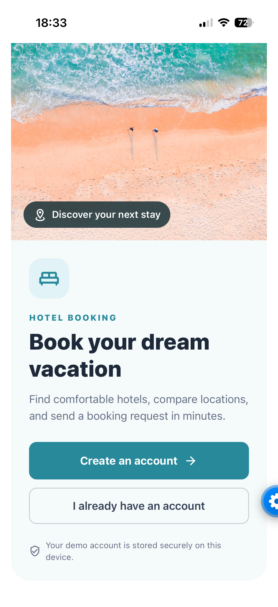
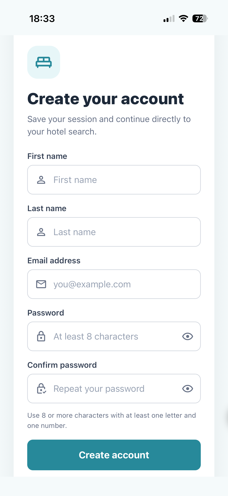
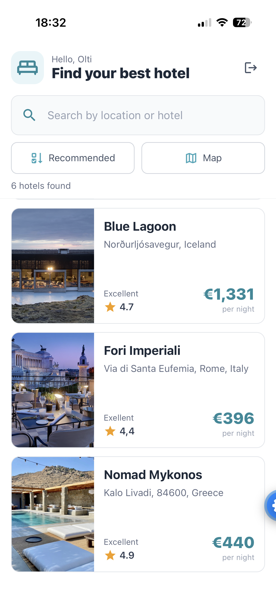
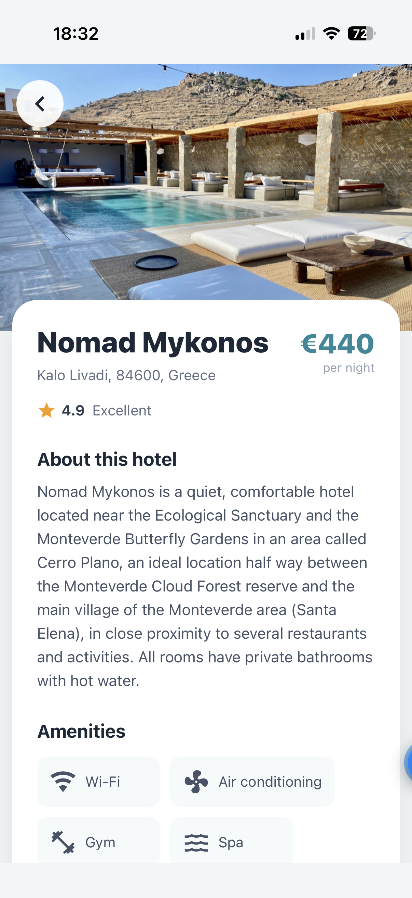
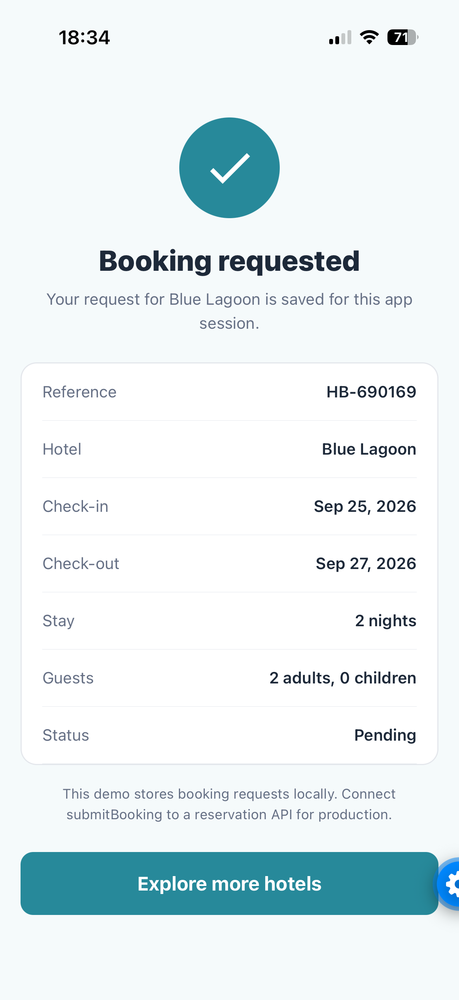

# Hotel Booking App

A responsive React Native application for discovering hotels, comparing destinations, and submitting booking requests. It runs with Expo SDK 57 on Android and iOS and includes device-local authentication backed by SQLite.

## Screenshots / GIF

<table>
  <tr>
    <td align="center">
      <strong>Welcome</strong><br />
      
    </td>
    <td align="center">
      <strong>Create account</strong><br />
      
    </td>
    <td align="center">
      <strong>Hotel search</strong><br />
      
    </td>
  </tr>
  <tr>
    <td align="center">
      <strong>Hotel details</strong><br />
      
    </td>
    <td align="center">
      <strong>Booking confirmation</strong><br />
      
    </td>
    <td></td>
  </tr>
</table>

## Features

- Create an account and log in with validated credentials.
- Store accounts in a persistent on-device SQLite database.
- Hash passwords with a random salt and PBKDF2 before storage.
- Restore authenticated sessions securely after restarting the app.
- Search hotels by name or location in real time.
- Sort results by recommended order, price, or guest rating.
- Display filtered hotels on an interactive native map.
- View hotel descriptions, pricing, ratings, and amenities.
- Select check-in and check-out dates and guest counts.
- Validate, assemble, and confirm complete booking requests.
- Adapt layouts for narrow phones, larger phones, tablets, and orientation changes.

## Tech stack

| Area | Technology |
| --- | --- |
| Application | React 19, React Native 0.86 |
| Tooling | Expo SDK 57, Metro, Babel |
| Navigation | React Navigation 7 with a stack navigator |
| Local database | Expo SQLite |
| Session storage | Expo SecureStore |
| Password security | Expo Crypto and `@noble/hashes` PBKDF2-SHA256 |
| Maps | React Native Maps |
| UI | React Native Paper, Expo Vector Icons, Safe Area Context |
| Dates | Moment and React Native Calendar Picker |
| Animation and gestures | React Native Reanimated, Worklets, and Gesture Handler |

## Architecture

The app uses provider-based state management and separates screens, reusable UI, persistence, domain validation, and static data.

```text
App.js
└── SQLiteProvider
    └── AuthProvider
        └── BookingProvider
            └── NavigationContainer
                └── StackNavigator
                    ├── Guest screens
                    │   ├── Welcome
                    │   ├── LogIn
                    │   └── SignUp
                    └── Authenticated screens
                        ├── Home
                        ├── Single
                        ├── Booking
                        └── BookingConfirmation
```

```text
src/
├── components/   Reusable form, hotel, calendar, and icon components
├── context/      Authentication and booking state/actions
├── data/         Static hotel catalogue and map coordinates
├── database/     SQLite schema and migrations
├── navigation/   Guest/authenticated navigation flow
├── screens/      Application pages
├── services/     Password hashing and session persistence
└── utils/        Authentication, booking, filtering, and sorting rules
```

Authentication flows through `AuthContext`: form validation runs first, credentials are normalized and hashed, parameterized queries write to SQLite, and the active user ID is stored in SecureStore. Booking data flows from the selected hotel into the booking form, through validation, into `BookingContext`, and finally to the confirmation screen.

## Installation

### Prerequisites

- Node.js 20.19 or newer
- npm
- The current Expo Go application on an Android or iOS device
- A phone and development computer connected to the same network

### Setup

```bash
git clone git@github.com:Dede9274/Personal_Projects.git
cd ./Personal_Projects/hotel-booking-app
npm install
npm start
```

When Metro displays its QR code:

- On Android, open Expo Go and select **Scan QR Code**.
- On iOS, scan the code with the Camera app and open the Expo Go notification.
- Keep the Metro terminal open while using the app.

Useful commands:

```bash
npm start                 # Start Metro and display the Expo Go QR code
npm run android           # Open on a connected Android target
npm run ios               # Open on an iOS target; requires macOS for Simulator
npx expo start --tunnel   # Use when the phone cannot reach the local network URL
npx expo start --clear    # Clear Metro's cache
```

Press `r` in the Metro terminal to reload and `Ctrl+C` to stop the server.

## Environment configuration

No `.env` file, API key, PostgreSQL server, or hosted backend is required for this version.

| Setting | Current value or location |
| --- | --- |
| Expo application configuration | `app.json` |
| Local database name | `hotel-booking.db` in `App.js` |
| Database schema version | SQLite `PRAGMA user_version = 1` |
| Hotel catalogue | `src/data/data.json` |
| Android/iOS session key | `hotel-booking.user-id` in SecureStore |
| App orientation | Portrait |
| Expo SDK | 57 |

The `users` table contains the user's name, case-insensitive unique email, password hash, password salt, and account creation timestamp. Passwords are never stored as plain text. Clearing the application's device data removes local accounts and sessions.

A production deployment should supply backend configuration through environment variables and keep secrets on the server rather than in the mobile bundle.

## API documentation

This portfolio version does not call a reservation or authentication HTTP API. Authentication is local, hotels come from the bundled JSON catalogue, and booking requests remain in memory for the current app session.

### Authentication service

Provided by `src/context/AuthContext.js`:

| Method | Input | Result |
| --- | --- | --- |
| `signUp` | `{ firstName, lastName, email, password }` | Creates a SQLite user and starts a session |
| `signIn` | `{ email, password }` | Verifies the PBKDF2 hash and starts a session |
| `signOut` | None | Clears the stored session and returns to guest navigation |

Sign-up passwords must contain at least eight characters, one letter, and one number. Email addresses are trimmed, converted to lowercase, and enforced as unique.

### Booking request

`createBookingRequest` in `src/utils/booking.js` produces:

```json
{
  "hotelId": 3,
  "checkIn": "2026-10-01",
  "checkOut": "2026-10-07",
  "adults": 2,
  "children": 0
}
```

`submitBooking` adds a reference such as `HB-123456`, a `Pending` status, and an ISO request timestamp. The production integration point is `submitBooking` in `src/context/BookingContext.js`.

Validation rules require a selected hotel, both dates, a check-out date after check-in, at least one adult, and a non-negative whole-number child count.

## Testing

The project currently uses build validation and a documented manual test flow; an automated test runner has not yet been added.

### Validation commands

```bash
npx expo-doctor@latest
npx expo export --platform android --output-dir /tmp/hotel-booking-export --clear
git diff --check
```

### Manual test checklist

1. Create an account using a valid name, email, and password.
2. Confirm duplicate emails, invalid emails, weak passwords, and mismatched passwords show errors.
3. Log out, log in again, close the app, and confirm the session is restored.
4. Search for a hotel name or destination and confirm the list filters immediately.
5. Test every sort order and switch between list and map views.
6. Open a hotel and verify its price, description, rating, and amenities.
7. Start a booking and verify the selected hotel appears on the form.
8. Test missing dates, an invalid date range, and invalid guest counts.
9. Submit a valid request and verify every value on the confirmation screen.
10. Repeat the main flow on a narrow phone, larger phone, and tablet or rotated device.

The current codebase passes all 21 Expo Doctor compatibility checks and produces a successful Android production bundle.

## Future improvements

- Replace device-local authentication with a server-side API and PostgreSQL or a managed identity provider.
- Persist booking requests remotely and add booking history, modification, and cancellation.
- Add live hotel availability, pricing, payments, and email confirmations.
- Add Jest and React Native Testing Library unit/component tests plus end-to-end tests with Maestro or Detox.
- Add CI checks for linting, tests, Expo Doctor, and production builds.
- Cache hotel images and catalogue data for offline use.
- Add favorites, filters, localization, accessibility audits, and dark mode.
- Publish development and production builds through EAS Build.
