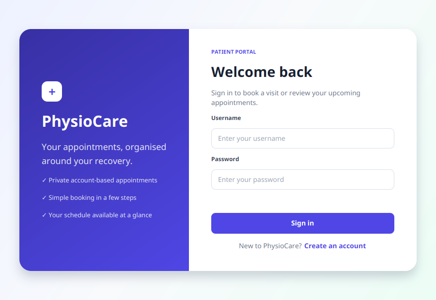
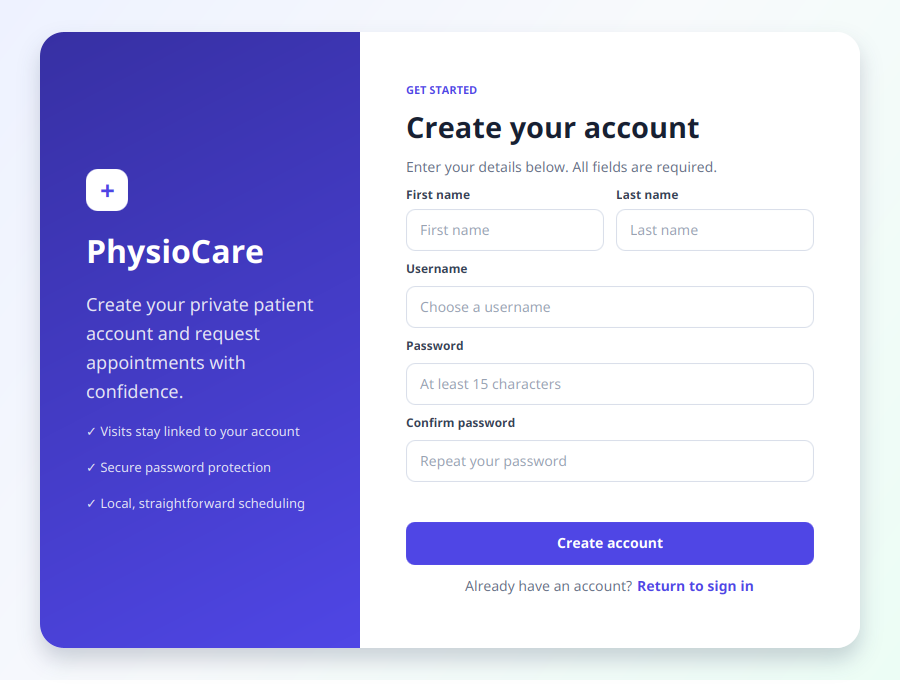
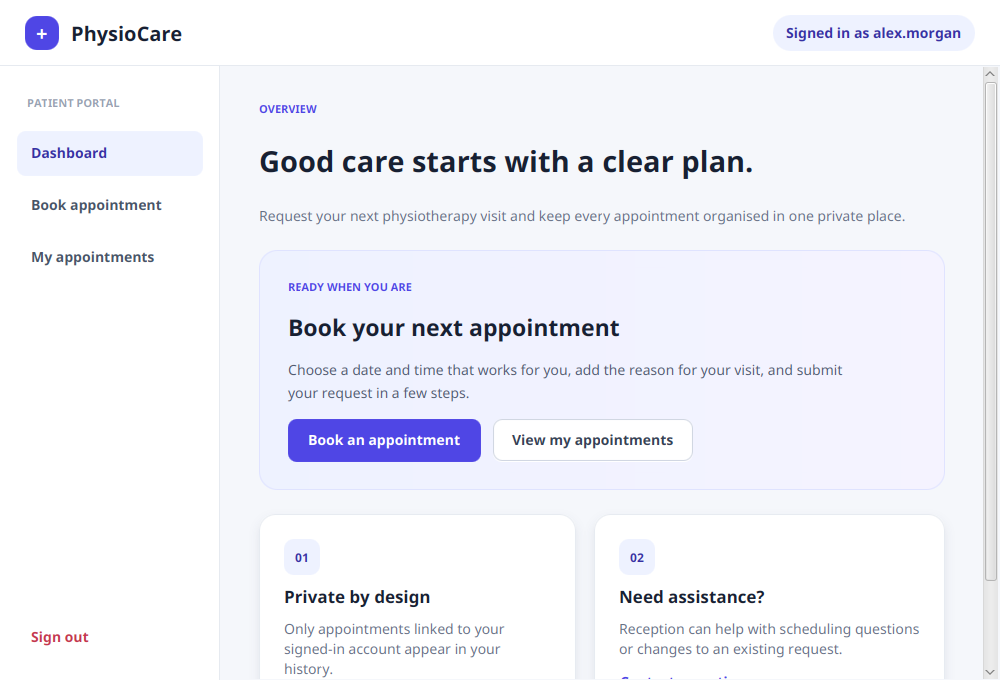
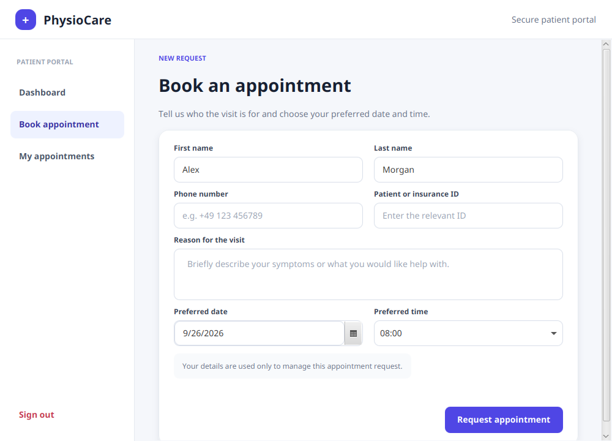
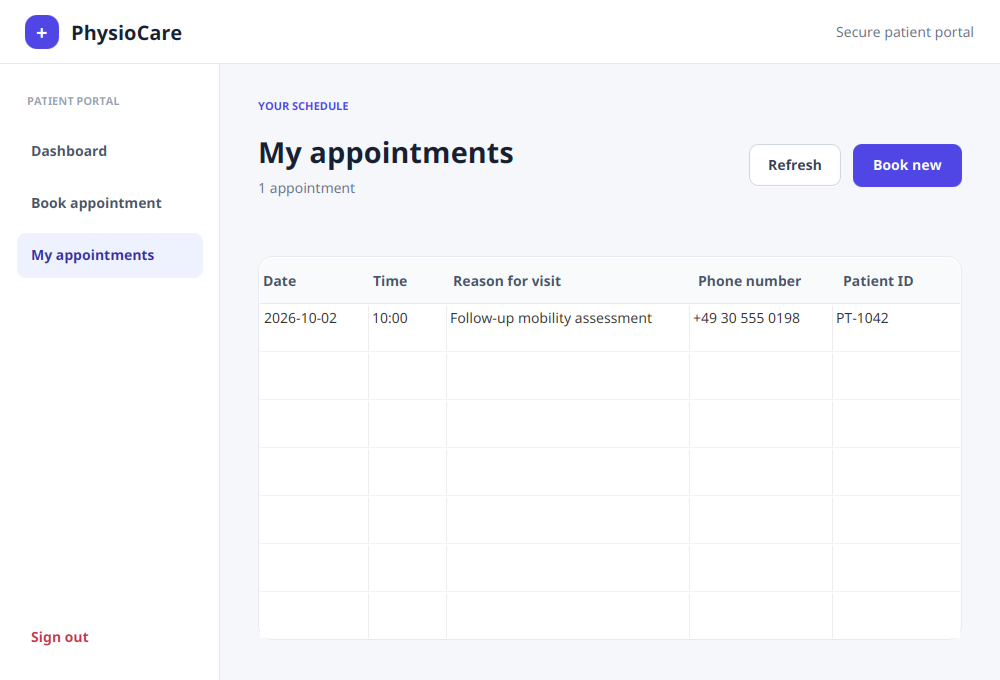

# PhysioCare Medical Appointment Scheduler

PhysioCare is a JavaFX desktop application for creating a patient account, signing in, requesting physiotherapy appointments, and reviewing a private appointment history.

Each appointment belongs to the authenticated user who created it. The application uses an embedded SQLite database, so it does not require a separate database server or database account.

## UI preview

### Sign in and account creation

| Sign in | Create an account |
| --- | --- |
|  |  |

### Patient dashboard



### Book and review appointments

| Book an appointment | My appointments |
| --- | --- |
|  |  |

## Features

- Patient registration and sign-in
- Account-scoped appointment data
- Appointment requests with patient details, visit reason, date, and time
- Automatic patient-name prefill for authenticated users
- Past-date prevention in the date picker
- Private appointment history ordered by date and time
- Embedded, automatically initialized SQLite database
- Smooth JavaFX scene transitions and responsive controls
- Inline validation and user-friendly success/error messages

## Technology

| Component | Technology |
| --- | --- |
| Language | Java 17 |
| Desktop UI | JavaFX 17, FXML, CSS |
| Database | SQLite |
| Database driver | Xerial SQLite JDBC |
| Build and dependency management | Maven |
| Tests | JUnit 5 |
| Password storage | Salted PBKDF2-HMAC-SHA256 |

Dependency versions are defined in [`pom.xml`](pom.xml).

## Requirements

- JDK 17 or newer
- Maven 3.9 or newer

Verify the tools are available:

```bash
java -version
mvn -version
```

## Run the application

Clone the repository and enter the application directory:

```bash
git clone git@github.com:Dede9274/Personal_Projects.git
cd Personal_Projects/medical-appointment-scheduler
```

Compile the project and run the tests:

```bash
mvn clean test
```

Start the JavaFX application:

```bash
mvn javafx:run
```

Maven downloads JavaFX, SQLite JDBC, and the test dependencies automatically.

## Database configuration

No manual database setup is required. On the first connection, the application creates this file in the working directory:

```text
medical_appointment_scheduler.db
```

The database file and SQLite journal files are ignored by Git.

To use a different location, export a SQLite JDBC URL before starting the application:

```bash
export MEDICAL_APP_DB_URL='jdbc:sqlite:/absolute/path/medical_appointment_scheduler.db'
mvn javafx:run
```

On PowerShell:

```powershell
$env:MEDICAL_APP_DB_URL = 'jdbc:sqlite:C:/data/medical_appointment_scheduler.db'
mvn javafx:run
```

The equivalent JVM system property is `medical.app.db.url`. Non-SQLite JDBC URLs are rejected.

The database schema is also documented in [`database/schema.sql`](database/schema.sql). If you have data from the original project, read [`database/migration_from_legacy.sql`](database/migration_from_legacy.sql) before importing it. A MySQL database file cannot be opened directly by SQLite.

## Project structure

```text
medical-appointment-scheduler/
├── src/
│   ├── application/
│   │   ├── Main.java                    # JavaFX application entry point
│   │   ├── SceneNavigator.java          # Animated screen navigation
│   │   ├── SessionManager.java          # Authenticated user session
│   │   ├── DatabaseConnection.java      # SQLite connection and schema setup
│   │   ├── PasswordHasher.java          # Password hashing and verification
│   │   ├── *Controller.java             # Screen behavior and database actions
│   │   ├── *.fxml                       # JavaFX screen layouts
│   │   └── application.css              # Shared visual design system
│   └── images/                          # Application assets
├── test/application/                    # JUnit tests
├── database/
│   ├── schema.sql                       # Standalone SQLite schema
│   └── migration_from_legacy.sql        # Legacy migration guidance
├── docs/screenshots/                    # README UI screenshots
├── pom.xml                              # Maven configuration
└── .env.example                         # Optional database URL example
```

## Application flow

```text
Sign up / Sign in
        │
        ▼
Authenticated session (user ID)
        │
        ├── Book appointment ──► INSERT with user_id
        │
        └── My appointments ───► SELECT WHERE user_id = ?
```

`SessionManager` retains the authenticated user ID for the lifetime of the desktop process. Controllers require that identity before opening protected screens or accessing appointment data.

## Security model

- Every appointment stores an owning `user_id` foreign key.
- Appointment queries are restricted with `WHERE user_id = ?`.
- Login, registration, appointment creation, and appointment lookup use prepared statements.
- New passwords use salted PBKDF2-HMAC-SHA256 with 600,000 iterations.
- Compatible legacy password hashes are upgraded after a successful login.
- SQLite foreign-key enforcement is enabled for every connection.
- Database credentials are not embedded in the source code.

This is a local desktop application. Its session is held in memory and is cleared when the user signs out or the process exits.

## Tests

Run all tests with:

```bash
mvn test
```

The test suite covers:

- SQLite schema creation and foreign-key enforcement
- User-owned appointment persistence
- Password hashing and verification
- Authentication session lifecycle

## License

This project is provided as a personal portfolio and learning project.
