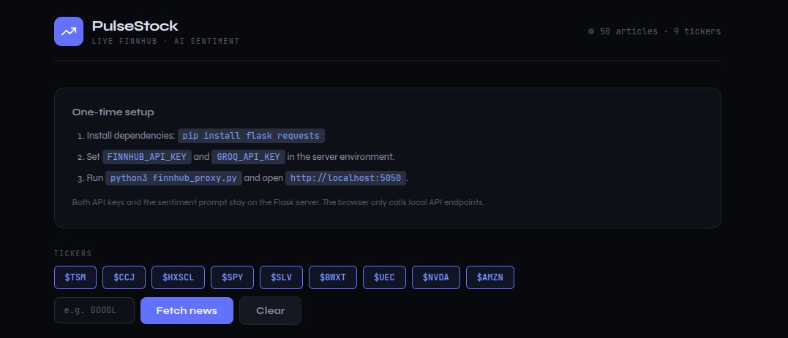
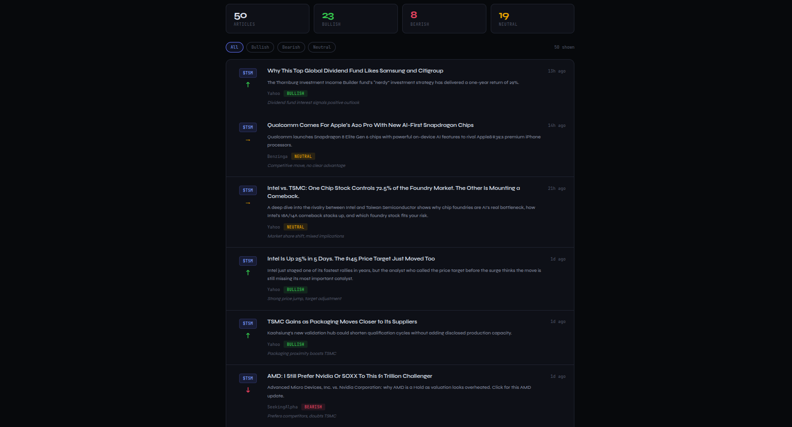

# PulseStock

PulseStock is a full-stack stock-news dashboard that collects recent company
headlines and uses an LLM to classify their likely market sentiment. Users can
select or add ticker symbols, fetch current news, and explore bullish, bearish,
or neutral stories with a short explanation for each classification.

The application combines live news from Finnhub with structured sentiment
analysis from Groq. It presents article totals and sentiment statistics, supports
interactive filtering, and links each result back to its original source.

## Features

- Fetches the latest seven days of company news for multiple ticker symbols.
- Classifies headlines as `bullish`, `bearish`, or `neutral` using Groq.
- Generates a concise explanation for every sentiment classification.
- Displays aggregate sentiment statistics and interactive result filters.
- Validates ticker symbols and incoming analysis requests on the backend.
- Handles invalid credentials, rate limits, timeouts, and upstream failures with
  actionable error messages.
- Keeps Finnhub and Groq credentials exclusively on the server.
- Includes mocked backend integration tests and dependency-free frontend tests.

## How it works

```text
Browser
   │
   ├── GET /api/news/<ticker> ──────── Flask ──────── Finnhub
   │
   └── POST /api/analyse-news ─────── Flask ──────── Groq
                                      │
                                      └── Validated sentiment JSON
```

Flask serves the modular frontend and both API endpoints from the same origin.
The browser never receives either third-party API key. Groq is constrained with
a strict JSON schema, and the backend validates its output before returning
enriched articles to the dashboard.

## Technology

- Python, Flask, and Requests
- Vanilla JavaScript ES modules
- HTML and CSS
- Finnhub company-news API
- Groq Chat Completions API with `openai/gpt-oss-20b`
- pytest and the Node.js test runner

## Run locally

1. Create accounts and generate your own API keys:

   - [Finnhub API key](https://finnhub.io/dashboard)
   - [Groq API key](https://console.groq.com/keys)

2. Create and activate a virtual environment, then install the dependencies:

```bash
cd stock_market_fetcher
python3 -m venv .venv
source .venv/bin/activate
python -m pip install -r requirements.txt
```

3. Create your local environment file from the provided template:

```bash
cp .env.example .env
```

Open `.env` and replace the placeholders with your own keys:

```dotenv
FINNHUB_API_KEY=your-finnhub-key
GROQ_API_KEY=your-groq-key
GROQ_MODEL=openai/gpt-oss-20b
```

The `.env` file is ignored by Git and must never be committed. The application
loads it automatically at startup, so the keys remain available after closing
the proxy or terminal. On Linux and macOS, you can restrict access to the file
with `chmod 600 .env`.

4. Start the server:

```bash
python3 finnhub_proxy.py
```

Open <http://localhost:5050>.

When opening a new terminal, activate the existing environment again with
`source .venv/bin/activate` before starting the server. `GROQ_MODEL` is optional
and defaults to `openai/gpt-oss-20b` if omitted.

## Screenshots

### Dashboard



### AI sentiment results



## Tests

Install the Python development dependency and run both suites:

```bash
python -m pip install -r requirements-dev.txt
PYTHONPATH=.. python -m pytest tests
npm test
```

The backend suite mocks Finnhub and Groq, so tests never call external APIs
or require real credentials. The frontend suite uses Node's built-in test runner
and has no npm dependencies.

## API

- `GET /api/health` reports whether both integrations are configured.
- `GET /api/news/<ticker>` fetches recent company news from Finnhub.
- `POST /api/analyse-news` accepts `{ "articles": [...] }` and returns the
  articles enriched with `sentiment` and `reason` fields.

## Project structure

```text
frontend/
├── index.html
├── css/
│   └── styles.css
└── js/
    ├── api.js
    ├── app.js
    ├── state.js
    └── ui.js
tests/
└── test_api.py
```
